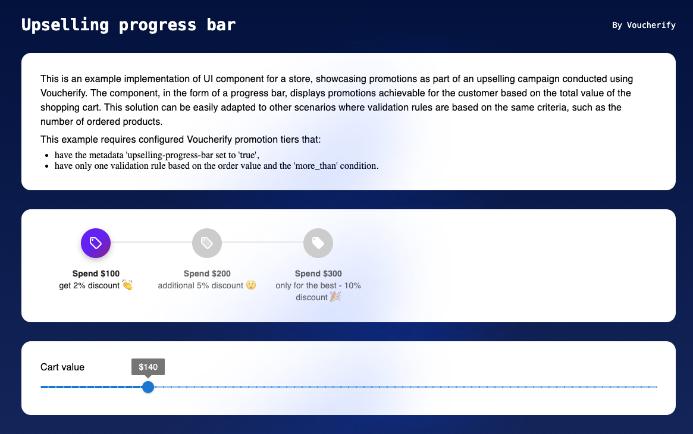

* [About Voucherify](#about)
* [Voucherify Upselling Progress Bar](voucherify-upselling-progress-bar)
* [How to run Voucherify samples locally?](#voucherify-locally)
* [Get support](#support)

# Welcome to Voucherify! <a id="about"></a>

Voucherify is an API-centric promotion engine for digital teams. It empowers marketers to quickly launch and efficiently manage promotions personalized with customer and session data, including coupons, gift cards, in-cart promotions, giveaways, referral, and loyalty programs.

## Voucherify Upselling Progress Bar <a id="voucherify-upselling-progress-bar"></a>
Voucherify Upselling Progress Bar is an example implementation of UI component for a store, showcasing promotions as part of an upselling campaign conducted using Voucherify. The component, in the form of a progress bar, displays promotions achievable for the customer based on the total value of the shopping cart. This solution can be easily adapted to other scenarios where validation rules are based on the same criteria, such as the number of ordered products.

This example requires configured Voucherify promotion tiers that:
- have the metadata 'upselling-progress-bar set to 'true',
- have only one validation rule based on the order value and the 'more_than' condition.




## How to run Voucherify samples locally? <a id="voucherify-locally"></a>

Follow the steps below to run locally.

1. Clone repository.

```
git clone https://github.com/voucherifyio/example-upselling-progress-bar.git
```
2. Create your [Voucherify account](http://app.voucherify.io/#/signup) (free tier, no credit card required).

3. Go to the Sandbox project’s settings and get your Application ID and Secret Key, see [Authentication](https://docs.voucherify.io/docs/authentication).

4. Rename .env.example to .env and paste your API keys:
```
VOUCHERIFY_APP_ID=<replace-with-your-application-id>
VOUCHERIFY_SECRET_KEY=<replace-with-your-secret-key>
```
5. Install dependencies.
```
npm install / yarn install
```
6. Start the Node server by entering one of the commands in the terminal.
```
npm run start / npm run dev || yarn start / yarn run dev 
```
7. Go to [http://localhost:3000](http://localhost:3000/) in your browser.

## Get support <a id="support"></a>

If you found a bug or want to suggest a new sample, please file an issue.

If you have questions, comments, or need help with code, we’re here to help:
* on [Slack](https://www.voucherify.io/community)
* by [email](https://www.voucherify.io/contact-support)

For more tutorials and full API reference, visit our [Developer Hub](https://docs.voucherify.io).

## Authors
[@patricioo1](https://github.com/patricioo1)